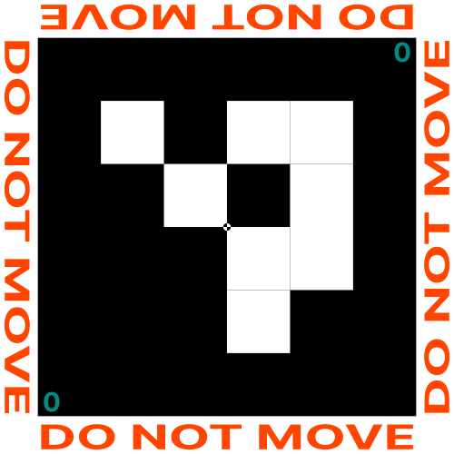

# GCP ArUCo Marker Generator

This is a simple python tool that will help you generate Ground Control Points
markers based on the [ArUCo
specification](https://www.uco.es/investiga/grupos/ava/node/26).





This will create an SVG file, with a real sizing of the image (that is if you
ask the tool to create a marker with a 1000mm side, that's exactly what it will
do).

You then just have to send the corresponding file to a printer if you want it on
a tarp or on a big sticker to make your own GCPs. You may have to convert it to
a PDF file or a JPEG file. Check with your local printer.

Usage is simple and default settings are sane, but things can be customized very
easily.

The complete list of parameters is as follows:
```
usage: marker_generator.py [-h] [-b] [-c] [--center_alt] [-d "4X4_50"] [--family] [--family-count 10] [-i 0]
                           [--id-color "darkcyan"] [--margin 50] [-o ./] [-s 500] [--print-id]
                           [--watermark "DO NO MOVE"] [--watermark-color "black"]
                           [--watermark-sides "Side String"] [--white-color "white"]

    Generates ArUco Markers to be used as Grounds Control Points.
    Default configuration is sensible. Output is highly customizable.
    This tools creates SVG files that can be sent to a printer immediately.
    The size parameter is important.

options:
  -h, --help            show this help message and exit
  -b, --border          Add a border around the marker. Default: False
  -c, --center          Add a center mark to the generated marker. Default: False
  --center_alt          Alternative center mark. Creates a center mark that is not an opposite image of the
                        surrounding pixels. Default: False
  -d, --dict "4X4_50"   ArUCo dictionary to use, one of 4X4_50, 4X4_100, 4X4_250, 4X4_1000, 5X5_50, 5X5_100,
                        5X5_250, 5X5_1000, 6X6_50, 6X6_100, 6X6_250, 6X6_1000, 7X7_50, 7X7_100, 7X7_250,
                        7X7_1000, ARUCO_ORIGINAL, APRILTAG_16h5, APRILTAG_25h9, APRILTAG_36h10,
                        APRILTAG_36h11, ARUCO_MIP_36h12. Default: "4X4_50"
  --family              Generate the whole marker family (disregard the chosen id). Default: False
  --family-count 10     Works with --family to generate a specific count of markers from a specific family.
                        The maximum number of markers is defined by the chosen family. Default: None
  -i, --id 0            ID of ArUCo tag to generate. Default: 0
  --id-color "darkcyan"
                        Color of the id text (if printed with --print-id). Can be any of the named SVG
                        colors. Default: "darkcyan"
  --margin 50           Side margin in mm. Default: 50
  -o, --output ./       Path where the output image containing ArUCo marker will be created. Default: ./
  -s, --size 500        Size in mm of the marker to be created. This size does not take into account the
                        margin. Default: 500
  --print-id            Print the id in the corner of the marker. Default: False
  --watermark "DO NO MOVE"
                        Add a watermark around the marker on the four sides around the marker. Default: None
  --watermark-color "black"
                        Color of the watermark text. Can be any of the named SVG colors. Default: "black"
  --watermark-sides "Side String"
                        Change the watermark on the side of the marker to this string. Default: None
  --white-color "white"
                        Color of the white part of the marker. Can be changed to improve contrast. Can be
                        any of the named SVG colors. Default: "white"

    For good size recommendations, please see http://www.agt.bme.hu/on_line/gsd_calc/gsd_calc.html .

    Colors that can be used are either RGB value in hexadecimal notation (with a leading #), an rgb-function (such as rgb(123,45,67) ) or named colors from the list at https://www.w3.org/TR/SVG11/types.html#ColorKeywords .
```


## Setup and use
### First installation
As this tool is written in python, we are going to use a virtual environment to
setup the dependencies.

This tool is written to be used with python3 and to be used with Linux.

The following commands should be typed in a
[terminal](https://ubuntu.com/tutorials/command-line-for-beginners#1-overview)
to setup the environment:
```bash
git clone https://www.github.com/gromain/gcp_aruco_generator
cd gcp_aruco_generator
python3 -m venv venv
source venv/bin/activate
pip3 install -r requirements.txt
```

From this point on, the use of this tool is quite simple. You just type the
command you need:
```bash
./marker_generator.py -c -b --print-id --id 1
```

Once you're done, just deactivate the virtual environment:
```bash
deactivate
```


### Subsequent uses
If you need to create more markers, or use a different dictionary, you will
need to activate the virtual environment again:
```bash
source venv/bin/activate
./marker_generator.py -c -b --print-id -s 800 --id 23
```

Once again, do not forget to deactivate the environment once you're done:
```bash
deactivate
```


## Usage with [Find GCP](https://github.com/zsiki/Find-GCP)
This tool was created to ease the use of ArUCo marker as GCPs. After a flight
you can use the [Find GCP tool](https://github.com/zsiki/Find-GCP) to find the
markers in your pictures.


## Inspirations
This project is similar to those others tools (yet different from them in
several ways, mainly in that this tool creates a vectorized marker instead of
a png):

- The original inspiration: [arucogen](https://github.com/okalachev/arucogen)
- Another generator: [aruco-generator](https://github.com/fdcl-gwu/aruco_generator)
- A library in JS that also provides a generator: [js-aruco2](https://damianofalcioni.github.io/js-aruco2/)
- The previous version of this library: [js-aruco](https://github.com/jcmellado/js-aruco)


## Compatibility with [geoBits](https://github.com/dronemapper-io/aruco-geobits)
In theory, you should be able to generate geoBits markers. However, they use a
custom dictionary for the markers. This dictionary has not been integrated in
this tool and will not be, as we encourage the use of the standard dictionaries
to improve interoperability. However, if someone wants to develop this
functionality, you are very welcome to do so!


## Development Roadmap
Here are some functionalities I'd like to develop for this tool. Suggestions are
welcome!

- Add direct to PDF output (with [cairoSVG](https://cairosvg.org/documentation/))
- Add recommended parameters for FindGCP
- Add a GUI and cross platform capabilities
